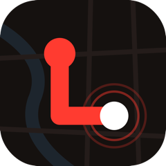
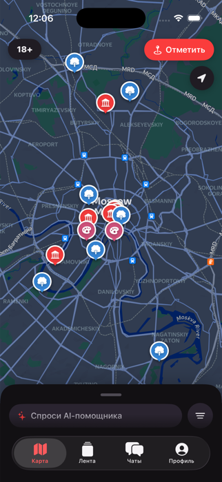
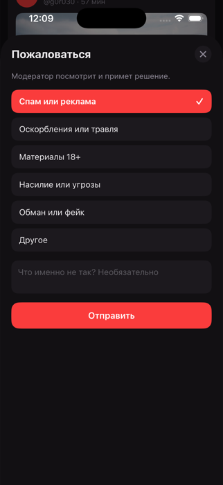

<div align="center">

  

  <h1>Localee для iPhone</h1>

  <p><b>Гид по Москве, который собирает маршрут под тебя</b><br>
  Нативное приложение на Swift и SwiftUI — тот же аккаунт и те же данные, что на сайте.</p>

  <p>
    
    
    
    
  </p>

</div>

---

## Зачем это

Планировать прогулку по городу неудобно: подборки в интернете не знают, сколько у тебя времени
и денег, а карта не понимает, что ты идёшь вдвоём и хочешь уложиться в три часа.

Localee делает наоборот — ты задаёшь рамки, а маршрут появляется прямо на карте. Рядом живёт
социальная часть: лента, друзья, чаты и метки от других людей.

Это приложение — второй клиент проекта. Первый — сайт [localee.ru](https://localee.ru),
его исходники лежат вместе с бэкендом в репозитории
[moskva-git](https://github.com/HovhannisyanGor/moskva-git).
**Аккаунт, лента, чаты и достижения общие:** отметил место в телефоне — видно на сайте,
и наоборот.

## Как выглядит

<div align="center">
  
  &nbsp;&nbsp;&nbsp;
  
  <p><i>Карта с местами по категориям · жалоба на чужую запись</i></p>
</div>

## Экраны

**Карта** — места по категориям (достопримечательности, парки, музеи, рестораны, развлечения),
фильтры по времени, бюджету и компании, шторка снизу, раздел 18+ и пользовательские метки:
скопления, сходки, дрифт. Метки живут сутки и исчезают сами.

**Лента** — посты с текстом, фотографиями и документами, лайки, комментарии, пересылка в чат,
вкладки «Все» и «Друзья».

**Чаты** — личные и групповые. Свайп для ответа, реакции эмодзи, редактирование, мультивыбор,
пересылка, галочки прочтения, точка «в сети», мини-профиль по тапу на имя.

**Профиль** — данные, обложка, интересы, друзья, достижения за посещённые места и настройки:
тема, приватность, уведомления.

Светлая и тёмная тема переключаются вручную или следуют системной.

## Как устроено

```
Localee/
  LocaleeApp.swift       точка входа, инициализация карты
  APIClient.swift        весь сетевой слой — одно место, где знают про сервер
  Models.swift           модели ответов API
  MapScreen.swift        карта, фильтры, маршрут
  YandexMap.swift        обёртка Яндекс MapKit для SwiftUI
  FeedScreen.swift       лента и публикация
  ChatsScreen.swift, ChatConversation.swift, GroupChat.swift
  ProfileScreen.swift, SettingsScreen.swift, UserProfileScreen.swift
  Attachments.swift      фото и документы: показ и выбор
  ReportSheet.swift      жалобы
  Gamification.swift     достижения и уровни
```

Никаких node_modules, Metro и дев-серверов — обычное нативное приложение.

Три места, где легко споткнуться. Все они отдельно закомментированы в коде, но лучше знать заранее:

- **Карта в симуляторе.** `YMKMapView` создаётся с `vulkanPreferred: true` — без этого
  на Apple Silicon карта просто не рисуется.
- **Флаг компоновщика `-ObjC`.** SDK Яндекса статический, а `setApiKey` и часть методов лежат
  в категориях Objective-C. Без флага линковщик их выбрасывает, и приложение падает при старте.
- **Разбор вложений.** У `Attachment` свой `init(from:)`. Синтезированный `Codable` в Swift
  НЕ подставляет значения по умолчанию: для отсутствующего ключа он падает с `keyNotFound`,
  а сервер не присылает `name` и `mime` у фотографий. Из-за этого когда-то переставала
  обновляться вся лента.

## Запуск

Нужен Xcode 16 или новее.

```bash
open Localee.xcodeproj
```

Сверху выбрать симулятор (например, iPhone 17 Pro) и нажать **▶**.

Собрать из терминала:

```bash
xcodebuild -scheme Localee -destination 'platform=iOS Simulator,name=iPhone 17 Pro' build
```

### Ключ карты

Репозиторий публичный, ключей в нём нет. Создай файл `Localee/Secrets.local.xcconfig`:

```
YANDEX_MAPKIT_KEY = вставь_свой_ключ
```

Файл в `.gitignore`, значение подставляется в `Info.plist` на сборке. Без ключа приложение
соберётся и запустится, но вместо карты покажет подсказку — остальные экраны работают.

Ключ берётся в кабинете разработчика Яндекса (MapKit Mobile SDK, используется бесплатная
версия Lite).

### Новые файлы

Проект генерируется из `project.yml` через [XcodeGen](https://github.com/yonaskolb/XcodeGen).
После добавления нового `.swift`-файла:

```bash
xcodegen generate
```

Сам `Localee.xcodeproj` закоммичен, чтобы проект открывался без установки XcodeGen.

### Если симулятор не находит сервер

DNS симулятора иногда не резолвит домены. Разово на Mac:

```bash
echo "80.78.244.37 api.localee.ru" | sudo tee -a /etc/hosts
```

На реальном iPhone не требуется.

## Создатели

<table>
  <tr>
    <td align="center" width="170">
      <b>Эрик Жамкочян</b>
    </td>
    <td>
      iOS-приложение: чаты и группы, профиль и настройки, интерфейс ленты, достижения.
    </td>
  </tr>
  <tr>
    <td align="center" width="170">
      <a href="https://github.com/HovhannisyanGor">
        <br>
        <b>Гор Оганнисян</b>
      </a><br>
      <sub>@HovhannisyanGor</sub>
    </td>
    <td>
      Карта на Яндексе, вложения, жалобы, синхронизация с сайтом, бэкенд и инфраструктура.
    </td>
  </tr>
</table>

Проект начат в июле 2026 года.

## Статус

Приложение собрано и работает, готовится к публикации.
Сайт уже доступен на [localee.ru](https://localee.ru).

Дальше: подтверждение почты и восстановление пароля, маршруты от ИИ-помощника, Android.
